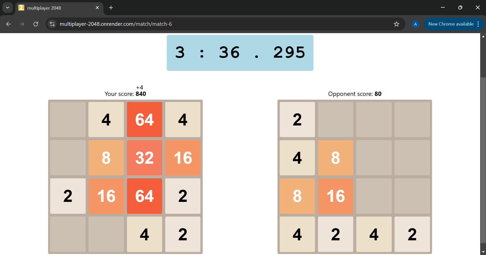

# multiplayer-2048
2048, but with friends!

(basically, you and one more person race to get the higher score in 5 minutes.)

URL: https://multiplayer-2048.onrender.com/
Because I've hosted this on Render's free tier, there's a high likelihood that they've "spun down" the site due to inactivity. So if the site seems to not be loading, don't worry, it'll take about a minute to come online - sorry!

## How to play
You can play a public game (with a random other player) or a private game (only people with the link can join).
### Public games:
On the home page (https://multiplayer-2048.onrender.com/), click the "Join any open public lobby" button! Then, it'll redirect you to a game. It's that simple!
### Private games:
You can start a new private game by clicking the "Start a new private game" button on the home page. You'll be redirected to a private lobby. Share the URL of the lobby to your friends for them to join.

And if you want to join a private game, ask whoever started it for the link!

## How it's made
just plain NodeJS, express and socket.io for the multiplayer!

that's all - have fun :)

